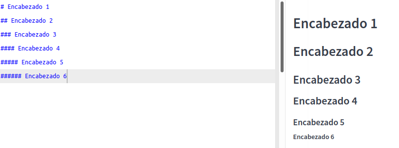
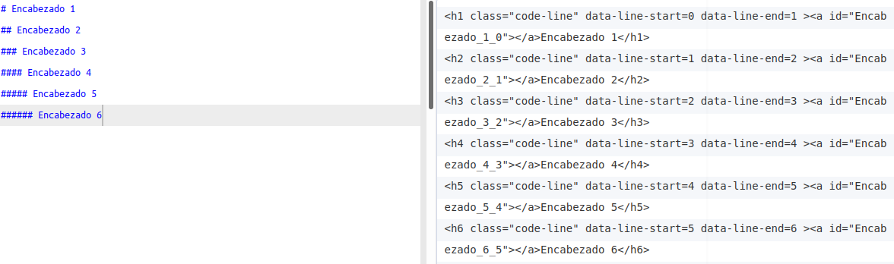
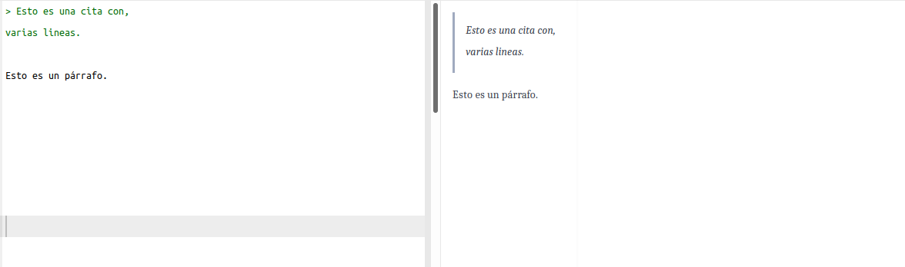
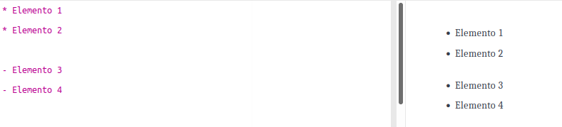
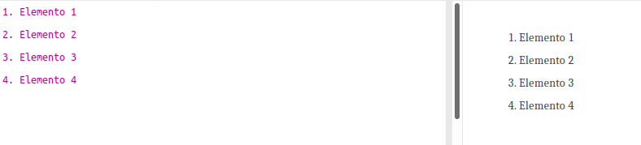
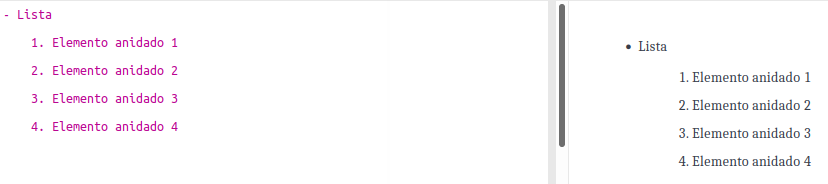
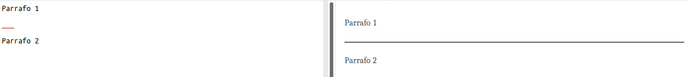

# Markdown

- [Encabezados/Títulos](#encabezados-t-tulos)
- [Citas](#citas)
- [Listas](#listas)
  - [Listas desordenadas](#listas-desordenadas)
  - [Listas ordenadas o numéricas](#listas-ordenadas-o-num-ricas)
  - [Anidar listas](#anidar-listas)
- [Separaciones físicas entre secciones de texto](#separaciones-f-sicas-entre-secciones-de-texto)
- [Estilo al texto](#estilo-al-texto)
- [Insertar enlaces de texto o descarga](#insertar-enlaces-de-texto-o-descarga)
- [Insertar imágenes](#insertar-im-genes)
- [Alternativa en la creación de enlaces e inserción de imágenes](#alternativa-en-la-creaci-n-de-enlaces-e-inserci-n-de-im-genes)
  - [Crear enlaces de forma limpia y ordenada](#crear-enlaces-de-forma-limpia-y-ordenada)
  - [Insertar imágenes de forma simple y ordenada](#insertar-im-genes-de-forma-simple-y-ordenada)
- [Insertar código](#insertar-c-digo)
  - [Insertar bloques de código](#insertar-bloques-de-c-digo)
  - [Resaltar código dentro de un texto de tipo párrafo](#resaltar-c-digo-dentro-de-un-texto-de-tipo-p-rrafo)
- [Realizar listas de tareas o checklist](#realizar-listas-de-tareas-o-checklist)
- [Crear tablas](#crear-tablas)
- [Insertar comentarios o notas al pie de página](#insertar-comentarios-o-notas-al-pie-de-p-gina)
- [Definir abreviaciones de palabras](#definir-abreviaciones-de-palabras)
- [Anular código markdown](#anular-c-digo-markdown)
- [Insertar vídeos](#insertar-v-deos)
- [Tabla/índice de contenidos](#tabla--ndice-de-contenidos)
- [Herramientas](#herramientas)
- [Referencias](#referencias)


## Encabezados/Títulos
Mediante el carácter almohadilla `#` podemos crear encabezados. Markdown permite crear títulos o encabezados de nivel uno, dos, tres, cuatro, cinco y seis.




Equivalencia entre el código Markdown y código html:




## Citas
Para incluir una cita tenemos que usar el símbolo `>` seguido de un espacio antes del texto que queremos citar.




## Listas
### Listas desordenadas
Mediante el símbolo `*` o `-` podemos crear listas desordenadas.



### Listas ordenadas o numéricas
Para obtener listas ordenadas numéricamente tenemos que escribir un número seguido de un punto y un espacio antes de comenzar a escribir.



### Anidar listas
Para anidar una lista tan solo tenemos que incluir un espacio o presionar la tecla `Tab` (Tabulador).




## Separaciones físicas entre secciones de texto
Para introducir una separación física entre dos secciones de texto hay que escribir 3 guiones bajos seguidos `___`.




## Estilo al texto

|Formato|Código|Resultado|
|---|---|---|
|Negrita|`**palabra**`|**palabra**|
|Cursiva|`*palabra*`|*palabra*|
|Tachado|`~~palabra~~`|~~palabra~~|
|Negrita + Cursiva|`***palabra***`|***palabra***|
|Tachado, Negrita y Cursiva|`**palabra**`|~~**palabra**~~|

Para subrayar palabras se debe hacer uso de código html:
```html
<u>subrayar en markdown</u>
```


## Insertar enlaces de texto o descarga

|Formato|Código|Resultado|
|---|---|---|
|Insertar enlaces en un texto.|\[texto](URL)|[Google](www.google.es)|
|Insertar enlaces sin texto.|\<URL>|<https://www.google.es>|


## Insertar imágenes
El método para insertar imágenes es similar al método para insertar enlaces. La sintaxis es la siguiente:
```


```

**Nota:** La url puede ser una dirección local o una dirección que apunte a una imagen alojada en un servidor web.


## Alternativa en la creación de enlaces e inserción de imágenes
### Crear enlaces de forma limpia y ordenada
Escribiremos un texto y cada vez que aparezca una palabra que queramos enlazar la pondremos entre corchetes `[]`. Por ejemplo:
```
[Markdown] es un lenguaje de marcado como html, pero con la particularidad que es mucho más sencillo y práctico de usar. [Markdown] puede aprenderse en un breve periodo de tiempo.
```
Una vez finalizado el texto, al final del documento definiremos los enlaces del siguiente modo:
```
[Markdown]: https://es.wikipedia.org/Markdown
```

De este modo, todas las palabras Markdown del documento que estén entre corchetes se enlazarán con la URL.

### Insertar imágenes de forma simple y ordenada
Si tenemos que insertar una imagen en varias partes del documento podemos escribir simplemente el texto alternativo de la imagen del siguiente modo:
```
![texto_alternativo]
```
Al final del documento definiremos la URL de la imagen del siguiente modo:
```
[texto_alternativo]: URL
```

**Nota:** Se puede añadir una imagen tantas veces como queramos definiendo la URL solamente una vez.


## Insertar código
### Insertar bloques de código
Markdown permite incluir bloques de código en cualquier lenguaje de programación. Para ello tan solo tenemos que escribir 3 acentos abiertos (**\`**) seguidos del nombre del lenguaje que se quiere insertar en el bloque, después realizar un salto de linea y escribir el código y por ultimo para señalar el fin del bloque de código escribir 3 acentos abiertos (**\`**). Un ejemplo de bloque de código en python:

````
```python
def main():
   print "Hola Mundo"
```
````

Visualización de ejemplo de código python en markdown:
```Python
def main():
  print "Hola Mundo"
```


### Resaltar código dentro de un texto de tipo párrafo
Para resaltar código dentro de una frase tenemos que usar el símbolo de acento abierto **\`** al inicio y al final del texto que queremos resaltar.

|Código|Resultado|
|---|---|
|\`texto\`|Texto sin resaltar `texto resaltado`.|


## Realizar listas de tareas o checklist
Markdown nos permite crear listas de tareas, para ello tan solo tenemos que abrir corchete, dejar un espacio y cerrar el corchete:
```
[ ]
```
En el caso que queramos marcar la tarea como realizada tenemos que reemplazar el espacio por una **X** del siguiente modo:
```
[X]
```

Por ejemplo:
```
- [X] Opción marcada
- [ ] Opción sin marcar
```

Visualización del ejemplo en markdown:

- [x] Opción marcada
- [ ] Opción sin marcar

**Nota:** Hay algunos editores de markdown que no permiten la visualización de checklists.

## Crear tablas
El primer paso para crear una tabla consiste en definir los títulos de las columnas. Para ello es necesario escribir los títulos de las columnas separados por `|`. Por ejemplo:
```
| Columna 1 | Columna 2 | Columna 3 |
```
Debajo de los títulos de las columnas hay que añadir la linea que acabamos de escribir para los títulos pero sustituyendo el nombre de la columna por 3 `-` seguidos. Por ejemplo:
```
| --- | --- | --- |
```
Por ultimo añadimos las filas con el contenido de cada columna. Por ejemplo:
```
| 1 | 2 | 3 |
| 4 | 5 | 6 |
| Hola | 34 | top |
```

También se puede justificar el texto dentro de la tabla a la derecha (`|:---|`), a la izquierda (`|---:|`) y al centro (`|:---:|`).

Un ejemplo de tabla completa con justificación:
```
| Columna 1 | Columna 2 | Columna 3 |
| :--- | :---: | ---: |
| 1 | 2 | 3 |
| 4 | 5 | 6 |
| Hola | 34 | top |
```
Visualización del ejemplo:

| Columna 1 | Columna 2 | Columna 3 |
| :--- | :---: | ---: |
| 1 | 2 | 3 |
| 4 | 5 | 6 |
| Hola | 34 | top |


## Insertar comentarios o notas al pie de página
Para insertar una nota al pie de página en markdown es necesario añadir un corchete y un acento circunflejo `[^`,  justo después de la palabra a la que queremos añadir el comentario a pie de pagina. Después escribirnos una palabra sin espacios que sirva como identificador del comentario y acto seguido añadir `]`.

Por ultimo añadir en cualquier parte del documento `[^<palabra_sin_espacios>]:` seguido de la nota que queremos poner al pie de pagina. Por ejemplo:

```
Esto es un ejemplo de nota a pie de página en Markdown[^1].

bla bla bla

[^1]: Lenguaje de marcado.
```

**Nota:** Se recomienda definir todas las notas al final del documento que se esta editando para mantener un orden.


## Definir abreviaciones de palabras
```
Escribimos una abreviación por ejemplo EU.

*[EU]: Union Europea.

A partir de estos momentos siempre que escribamos EU tendremos su definición disponible.
```

**Nota:** Se recomienda definir todas las abreviaciones al final del documento que se esta editando para mantener un orden.


## Anular código markdown
Markdown usa símbolos comunes para dar formato al texto que escribimos. Por lo tanto es posible que se den casos donde nos interese anular el código markdown. Para anular el código Markdown tendremos que usar el carácter `\` delante del símbolo usado por markdown para dar el formato.

Por ejemplo, cuando escribimos `*palabra*` se mostrara palabra de forma cursiva. Por lo que si queremos que no se aplique el código markdown y se muestre el texto real que hemos escrito tendremos que añadir `\` al inicio de la palabra `\*palabra*` y se mostrara `*palabra*` en lugar de *palabra*.


## Insertar vídeos
Markdown permite la inserción de video aunque depende también del editor que se este usando. Para añadir videos donde el editor de markdown no tenga ningún tipo de soporte:
```
[](url_del_vídeo_que_queremos_insertar)
```


## Tabla/índice de contenidos
Para crear un indice o tabla de contenidos basado en los encabezados de un documento.
```
[Nombre encabezado](#nombre-encabezado-minusculas)
```

**Nota:** En necesario sustituir los espacios y caracteres especiales como los acentos por `-`.

Por ejemplo:
```
- [Encabezado 1](#encabezado-1)
  - [Encabezado 1.1 índice](#encabezado-1-1--ndice)
- [Encabezado 1](#encabezado-1)
```

Visualización del ejemplo:

- [Encabezado 1](#encabezado-1)
  - [Encabezado 1.1 índice](#encabezado-1-1--ndice)
- [Encabezado 1](#encabezado-1)

**Nota:** También se puede crear el indice de forma automática utilizando una herramienta online. Para eso accedan a la siguiente [URL](https://ecotrust-canada.github.io/markdown-toc/). Acto seguido peguen el texto Markdown que han generado a la columna de la izquierda y presionen el botón `Convert`. Acto seguido en la columna de la derecha se generará el código que generará la tabla de contenido.


## Herramientas
- [Dillinger (Editor online)](https://dillinger.io/)
- [Typora (Editor local)](https://typora.io/)
- [Atom (Editor local)](https://atom.io/)


## Referencias
- [Aprender Markdown y MultiMarkdown de forma sencilla y rápida](https://geekland.eu/aprender-markdown-en-minutos)
- [Markdown Guide](https://www.markdownguide.org/)
